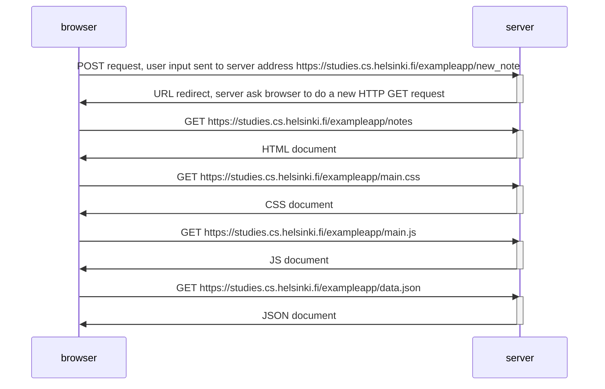

```mermaid

sequenceDiagram

participant browser
participant server

browser ->> server: POST request, user input sent to server address https://studies.cs.helsinki.fi/exampleapp/new_note
activate server
server->>browser: URL redirect, server ask browser to do a new HTTP GET request
deactivate server

browser->>server: GET https://studies.cs.helsinki.fi/exampleapp/notes
activate server
server->>browser: HTML document
deactivate server

browser->>server: GET https://studies.cs.helsinki.fi/exampleapp/main.css
activate server
server->>browser: CSS document
deactivate server

browser->>server: GET https://studies.cs.helsinki.fi/exampleapp/main.js
activate server
server->>browser: JS document
deactivate server

browser->>server: GET  https://studies.cs.helsinki.fi/exampleapp/data.json
activate server
server->>browser: JSON document
deactivate server


```
