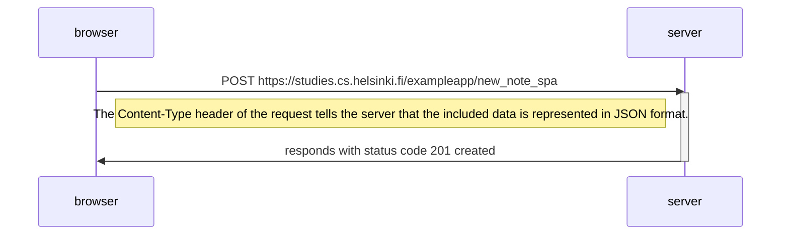

```mermaid

sequenceDiagram

participant browser
participant server

browser->>server: POST https://studies.cs.helsinki.fi/exampleapp/new_note_spa
activate server

Note right of browser: The Content-Type header of the request tells the server that the included data is represented in JSON format.

server->>browser: responds with status code 201 created
deactivate server

```
